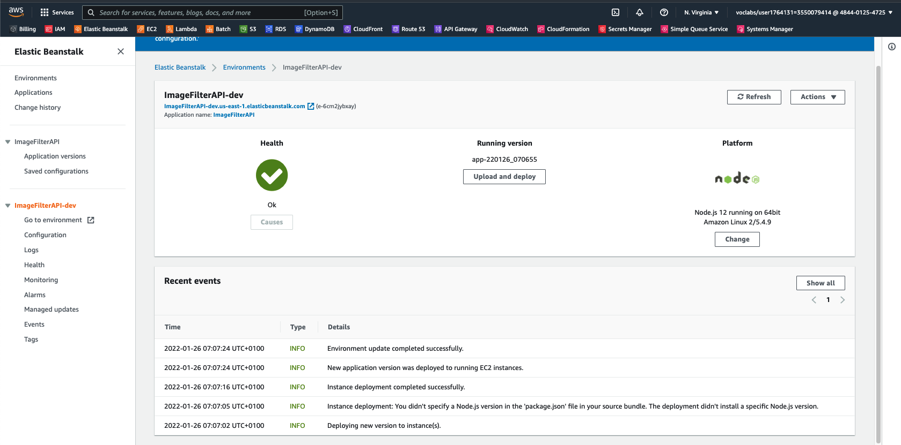

# Udacity Reviewer

## Udagram Image Filtering Microservice

Simple API service deployed to ElasticBeanstalk to fetch an image from a public S3 bucket.

To test go to (will expire after review):

http://imagefilterapi-dev.us-east-1.elasticbeanstalk.com/filteredimage?image_url=https://public-images-484401254725-dev.s3.amazonaws.com/Scheveningen.jpeg

## Elastic Beanstalk Status



# My future self
## Tasks
### Setup Node Environment

You'll need to create a new node server. Open a new terminal within the project directory and run:

1. Initialize a new project: `npm i`
2. run the development server with `npm run dev`

### The sole endpoint in the server.ts file

Check the endpoint in `./src/server.ts` which uses query parameter to download an image from a public URL, filter the image, and return the result.

A few helper functions are also used:

```typescript
import {filterImageFromURL, deleteLocalFiles} from './util/util';
```

### Deploying

Follow the process described in the course to 

1. Setup a new application:

    ```bash
    eb init --profile ud
    ```
2. Create new environment to deploy your image-filter serviceand:

    ```bash
    eb create --profile ud
    ```

3. Push changes:

    ```bash
    eb deploy
    ```


